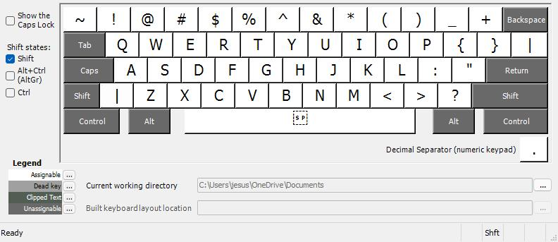

# United States (International) with AltGr dead keys

  - [Introduction](#introduction)
  - [Additions](#additions)
  - [Screenshots](#screenshots)
  - [Most common AltGr combinations](#most-common-altgr-combinations)
  - [How to Build or Install](#how-to-build-or-install)

## Introduction
Windows includes a keyboard layout called "_United States (International)_", which allows typing many special characters easily.
The layout defines several keys as "dead keys", such as the apostrophe (`'`) and double quotes (`"`).
This means that to enter a single `'`, you have to press `'` followed by a space.
This can be annoying when you need to enter a lot of these characters, since each now requires two keys to be pressed.

In Linux, there is a keyboard layout named "USA International (AltGr dead keys)" that solves this problem and still allows typing special characters.
If you want to type `'`, you just press `'`.
If you want to use `'` as a dead key, you use AltGr (right alt): e.g. `AltGr+' a` will produce `á`.

This repo is a modified version of the default Windows "United States (International)" keyboard layout that mimics the behaviour found in Linux.
All five dead keys (`` ` ``, `~`, `^`, `'` and `"`) are now only dead when AltGr is pressed, otherwise they function as normal keys.
Note that the original layout already defines several AltGr combinations, e.g. `AltGr+'` becomes `´`.
If you want to type these characters in the modified layout, you should follow the old keycombination with a space: e.g. `AltGr+' <SPACE>` will produce `´`.

## Additions
- [Schwa: ə](https://it.wikipedia.org/wiki/Scev%C3%A0)
- [Grade: °](https://it.wikipedia.org/wiki/Grado_(simbolo)) (already present but not visibile in the layout editor)

## Most common AltGr combinations
- (schwa) ə -> AltGr + x
- é -> (AltGr + ') + e
- è -> (AltGr + `) + e  
  _... (and so on for the other vowels) ..._
- (grade) ° -> AltGr + v

## How to Build or Install
You can download the latest installer from the [releases](https://github.com/jesuswasrasta/win-us-intl-altgr/releases) tab of this repo.

If you prefer to build from source, you can open the .KLC source file in [Microsoft Keyboard Layout Creator](https://www.microsoft.com/en-us/download/details.aspx?id=102134).
After opening the file, choose `Project > Build DLL` and Setup Package in the menu to create an installer.

## Screenshots ANSI
Default ANSI layout  

AltGr ANSI layout  

Shift ANSI layout  

AltGr+Shift ANSI layout  

Ctrl ANSI layout  

## Screenshots ISO
Default ISO layout  

AltGr ISO layout  

Shift ISO layout  

AltGr+Shift ISO layout  

Ctrl ISO layout  

